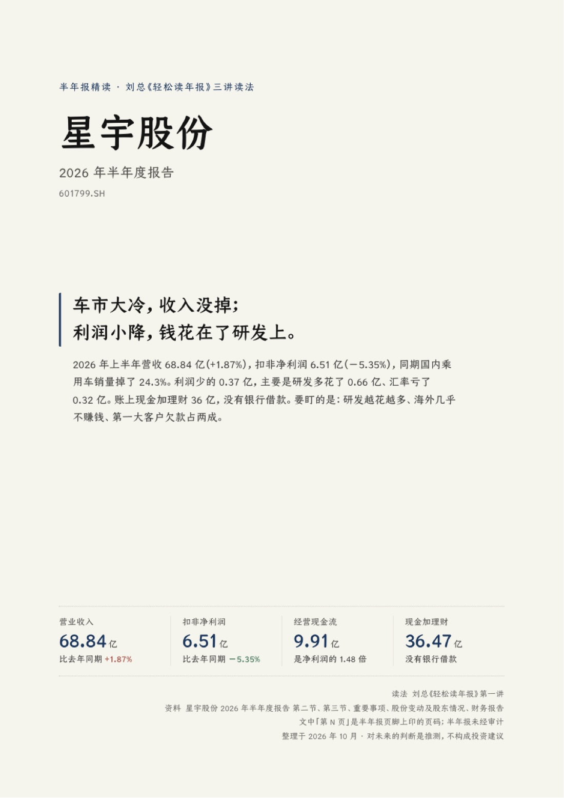
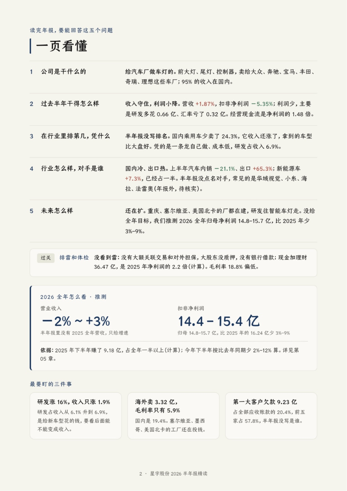
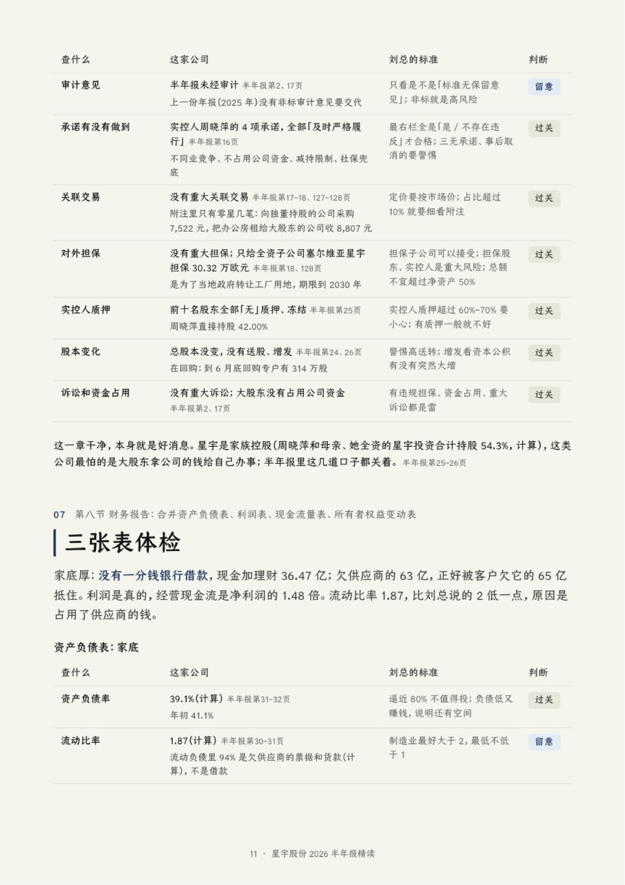
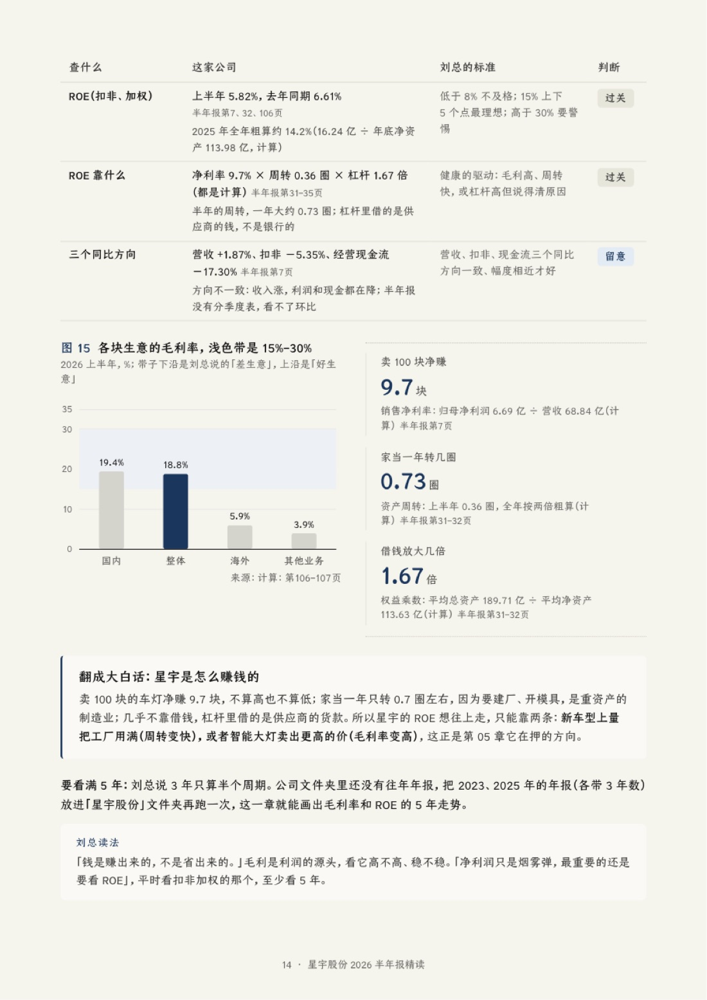

# nianbao：用刘总《轻松读年报》的方法精读年报

一个 AI agent Skill，[Claude Code](https://claude.com/claude-code) 和 Codex 都能用。把一家上市公司的**年报或半年报 PDF** 丢给它，它会按刘总《轻松读年报》三讲的方法从头读一遍，交给你一份 16–20 页、不懂会计也看得懂的 PDF 精读报告。

- **第一讲**：先用第二节「主要财务指标」做五分钟的规定动作，再精读第三节「管理层讨论与分析」，回答五个问题，给出明年的业绩区间。
- **第二讲**：读重要事项（承诺、关联交易、担保）和三张合并报表，第一要义是排雷。
- **第三讲**：读所有者权益和财务分析（毛利率、净资产收益率、同比环比）。

报告里**每个数字都标了年报页码**，交付前会自动核对数字出处；自己算出来的数都列了算式；推测的部分写明依据和「什么情况下会错」。

## 效果预览

下面是读星宇股份 2026 年半年报做出来的报告（节选）：

| 封面 | 一页看懂 |
|---|---|
|  |  |

| 先排雷 · 体检表 | 毛利率和净资产收益率 |
|---|---|
|  |  |

## 报告里有什么

| 章 | 内容 |
|---|---|
| 一页看懂 | 五个问题的答案、排雷和体检结论、明年（或今年全年）业绩区间、最要盯的三件事 |
| 00 先看成绩单 | 营收、扣非净利润、季度、现金流、非经常性损益、净资产收益率 |
| 01 公司是干什么的 | 年报原话 → 说人话，收入构成 |
| 02 过去一年干得怎么样 | 各业务增速、毛利率、费用、利润账 |
| 03 行业怎么样，对手是谁 | 行业规模、份额排名、对手、成长空间 |
| 04 凭什么赢 | 研发、激励、分红回购、说到做到 |
| 05 未来怎么走 | 战略翻成大白话、业绩指引、**我们的推测区间** |
| 06 先排雷 | 审计意见、承诺、关联交易、担保、实控人质押、股本变化 |
| 07 三张表体检 | 净现金（列算式）、资产负债率、应收账龄、利润真不真、自由现金流、未分配利润 |
| 08 毛利率和净资产收益率 | 毛利率高低和走势，ROE 拆成「净赚几块 × 转几圈 × 借钱放大几倍」 |
| 09 风险和要追问的问题 | 要盯 / 留意 / 放心，每条带「调研可以问」 |
| 名词小词典 | 报告里用到的专业词，一句大白话解释 |

读过的公司，之后再丢来它的季报、半年报或下一年年报，还能加一章「对答案」，看当初的推测准不准。

## 安装

**最省事：让你的 AI 帮你装。**把下面这句话发给 Claude Code 或 Codex：

```text
帮我安装这个 skill，按仓库里 INSTALL.md 的步骤做：https://github.com/siqiy438-source/nianbao-skill
```

**自己装：**在终端运行这一行（Claude Code、Codex 通用，会自动装到你电脑上有的那个）：

```bash
rm -rf /tmp/nianbao-skill && git clone --depth 1 https://github.com/siqiy438-source/nianbao-skill.git /tmp/nianbao-skill && bash /tmp/nianbao-skill/install.sh
```

需要 git 和 Python 3（macOS 上没有的话先运行 `xcode-select --install`）。Python 依赖会装进单独的环境 `~/.nianbao/venv`，不动系统的 Python。详细步骤、手动安装、更新和卸载见 [INSTALL.md](INSTALL.md)。

**字体（可选）**：版式按 kami（紙）的风格设计，正文字体是仓耳今楷。因为字体有授权限制，仓库里不带字体文件。没有这个字体时会自动换成思源宋体或系统宋体，报告照样能出，只是字体效果不同。如果你装了 [kami](https://github.com/tw93/kami) skill 并下载了它的字体，nianbao 会自动用上；也可以把 `TsangerJinKai02-W04.ttf`、`TsangerJinKai02-W05.ttf` 放进 `assets/fonts/`。

## 用法

装好后新开一个对话。Claude Code 里输入 `/nianbao`，再把年报 PDF 拖进来；Codex 里说「用 nianbao 读这份年报」，再给出 PDF 的路径。也可以直接说「帮我读一下这份年报」「这家公司有没有雷」。

年报全文去 [巨潮资讯网](https://www.cninfo.com.cn) 下载，要全文版，不要摘要版。

做完之后，年报所在的地方会多出一个以公司简称命名的文件夹：

```
星宇股份/
├── 星宇股份2026年半年度报告.pdf        ← 原件挪进来
├── 星宇股份2026半年报_第三节精读.pdf    ← 精读报告
└── 工作文件/2026半年报/                ← 导出的原文、report.json、预览图
```

ROE、毛利率报告里有几年就看几年；文件夹里本来就有往年年报的，会顺手多看几年。

## 文件

| 文件 | 干什么 |
|---|---|
| `SKILL.md` | Skill 的说明书：每一步怎么做 |
| `scripts/folder.py` | 整理文件夹：一家公司一个文件夹 |
| `scripts/extract.py` | 找第二节、第三节、重要事项、股东情况、财务报告，按页导出文字并标页码 |
| `scripts/check.py` | 交付前自检：结构、数字出处、名词解释、措辞、体检表 |
| `scripts/build.py` | 把 report.json 排成 PDF，并出每页的预览图 |
| `scripts/pages.py` | 把 PDF 的几页转成图片，给不能直接读 PDF 的 agent 核对用 |
| `run.sh` | 统一入口，自动挑 Python |
| `install.sh` `INSTALL.md` | 一键安装、更新，和给 agent 看的安装说明 |
| `references/刘总读法.md` | 三讲的方法论 |
| `references/报告格式.md` `references/写作规则.md` `references/名词解释.md` | 报告怎么写 |
| `references/示例-*.json` | 写好的范例（美的 2024 年报、星宇 2026 半年报、中际联合对答案） |
| `assets/` | 版式和图表样式（ECharts 离线版） |

## 说明

- **不构成投资建议。**报告只判断公司本身和业绩区间，不评股价贵不贵，不给买卖建议。
- 方法来自刘总《轻松读年报》三讲，`references/刘总读法.md` 是作者听课整理的笔记，课程内容版权归刘总所有。
- 图表用 [Apache ECharts](https://echarts.apache.org)（Apache-2.0）；版式风格参考 [kami](https://github.com/tw93/kami)。
- 代码按 [MIT](LICENSE) 许可开源。
